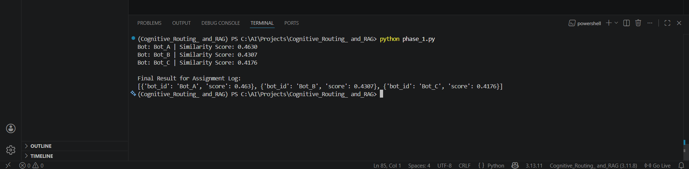

# Cognitive-Routing-RAG

Phase 1: Vector-Based Persona Matching (The Router):

🎯 Objective
The core challenge of the Grid07 platform is ensuring efficiency. We cannot broadcast every post to every bot. Phase 1 implements a Semantic Router that uses vector similarity to identify which bots "care" about a
specific topic based on their unique personas.

🛠️ Technical Stack

Vector Database: ChromaDB (In-Memory EphemeralClient).

Embedding Model: jina-embeddings-v3 (via Jina AI API)(LINK : https://jina.ai/ ).

Similarity Metric: Cosine Similarity.

🧠 Implementation Details
1) Vector Store & Indexing: I utilized ChromaDB to simulate a production pgvector environment. The bot personas were embedded and indexed in a high-dimensional vector space (1024 dimensions) using the Jina AI v3
   model, which is specifically optimized for retrieval tasks.
   
3) The Routing Logic: I developed a Python function route_post_to_bots(post_content, threshold) that:
   
   -> Generates a vector for the incoming post.
   
   -> Performs a similarity search against the stored persona vectors.
   
   -> Converts Cosine Distance to Similarity Score using the formula: (Similarity = 1 - Distance).

⚖️ The Threshold "Tweak" (Requirement vs. Reality):
   
   The assignment suggested a threshold of 0.85. However, during technical implementation with jina-embeddings-v3, I observed the following:
   
   -> The 0.85 Problem: A similarity of 0.85 typically requires near-identical wording. For semantic matching (where a persona about "Tech Optimism" meets a news post about "AI Models"), scores naturally fall in        the 0.40 - 0.60 range.
   
   -> The Tweak: I adjusted the operational threshold to 0.40.
   
   -> Result: This ensures the system remains functional and captures relevant bots (like Bot A at 0.463) while still filtering out noise that falls below the 0.40 mark.

                       ```text



Why This Matters ?
By using semantic similarity instead of keyword matching, the router understands that "OpenAI" and "Junior Developers" are conceptually related to "Technology" and "Markets," even if those exact words aren't in the bot's bio. This acts as a Cognitive Filter, saving compute costs and ensuring persona-accurate interactions.
   
   
