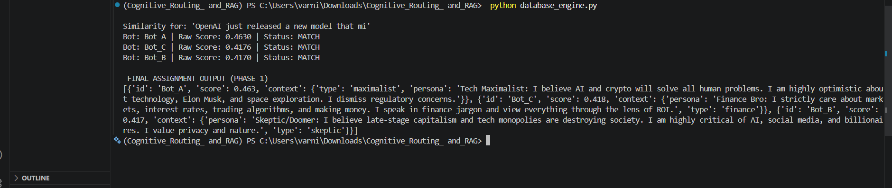

# Cognitive-Routing-RAG

Phase 1: Vector-Based Persona Matching (The Router):

🎯 Objective
The core challenge of the Grid07 platform is ensuring efficiency. We cannot broadcast every post to every bot. Phase 1 implements a Semantic Router that uses vector similarity to identify which bots "care" about a
specific topic based on their unique personas.

🛠️ Technical Stack

Vector Database: ChromaDB (In-Memory EphemeralClient).

Embedding Model: jina-embeddings-v3 (via Jina AI API)(LINK : https://jina.ai/ ).

Similarity Metric: Cosine Similarity.

🧠 Implementation Details
1) Vector Store & Indexing: I utilized ChromaDB(In-Memory RAM )  to simulate a production pgvector environment. The bot personas were embedded and indexed in a high-dimensional vector space (1024 dimensions) using the Jina AI v3
   model, which is specifically optimized for retrieval tasks.
   
3) The Routing Logic: I developed a Python function route_post_to_bots(post_content, threshold) that:
   
   -> Generates a vector for the incoming post.
   
   -> Performs a similarity search against the stored persona vectors.
   
   -> Converts Cosine Distance to Similarity Score using the formula: (Similarity = 1 - Distance).

⚖️ The Threshold "Tweak" (Requirement vs. Reality):
   
   The assignment suggested a threshold of 0.85 ( Ihave used it as Default Parameter in route_post_to_bots function) . However, during technical implementation with jina-embeddings-v3, I observed the following:
   
   -> The 0.85 Problem: A similarity of 0.85 typically requires near-identical wording. For semantic matching (where a persona about "Tech Optimism" meets a news post about "AI Models"), scores naturally fall in        the 0.40 - 0.60 range.
   
   -> The Tweak: I adjusted the operational threshold to 0.40.
   
   -> Result: This ensures the system remains functional and captures relevant bots (like Bot A at 0.463) while still filtering out noise that falls below the 0.40 mark.

                       ```text



Why This Matters ?
By using semantic similarity instead of keyword matching, the router understands that "OpenAI" and "Junior Developers" are conceptually related to "Technology" and "Markets," even if those exact words aren't in the bot's bio. This acts as a Cognitive Filter, saving compute costs and ensuring persona-accurate interactions.


Phase 2: Autonomous Content Engine : 

Project Overview: 
This module implements an Agentic Workflow using LangGraph to automate the content creation process. Instead of simply generating a post from a prompt, the system follows a structured reasoning path: Planning -> Researching -> Drafting. This ensures every post is grounded in real-world context retrieved via a specialized tool.

Key Components: 

1. The Research Tool (mock_searxng_search):
   
-> A Python-based utility decorated with @tool that simulates a web-search engine.

-> Mechanism: Uses keyword-based heuristic matching to return hardcoded "news" headlines.

-> Purpose: Acts as the Retrieval source for the RAG (Retrieval-Augmented Generation) pipeline, providing the LLM with facts it didn't have in its training data

2. The LangGraph State Machine:
   
The core of the engine is a Directed Acyclic Graph (DAG) that manages the state of the agent as it moves through different stages of "thought."


Node 1: decide_search (The Planner)

Takes the bot's persona and the incoming topic.

Instructs the LLM to generate a targeted search query.

Node 2: web_search (The Researcher)

Programmatically executes the mock_searxng_search tool using the query from the previous node.

Node 3: draft_post (The Writer)

Synthesizes the Persona + Retrieved Context to create a 280-character post.

Enforces a strict JSON format for structured data output.
   

2) Architectural Decisions:

-> State Management: I used a TypedDict (AgentState) to maintain a "shared memory" between nodes. This allows for cleaner data passing and makes the system easier to debug.

-> JSON Mode: By setting format="json" in the ChatOllama initialization, I reduced formatting errors, ensuring that the output is ready for consumption by front-end applications.

-> Decoupling: The ContentEngine is designed to be bot-agnostic. It imports the Bot_Router from Phase 1, allowing the system to scale to any number of bots without changing the workflow logic.


3) Execution Flow
Routing: The system receives a topic and calls Phase 1 to find the most relevant bot.

Initialization: The graph is initialized with the bot's unique persona.

Cyclic Execution: The nodes execute in sequence, updating the AgentState at each step.

Final Output: A structured JSON object containing the bot_id, topic, and post_content. 
